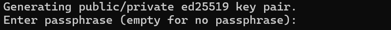
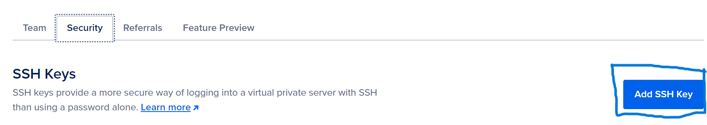
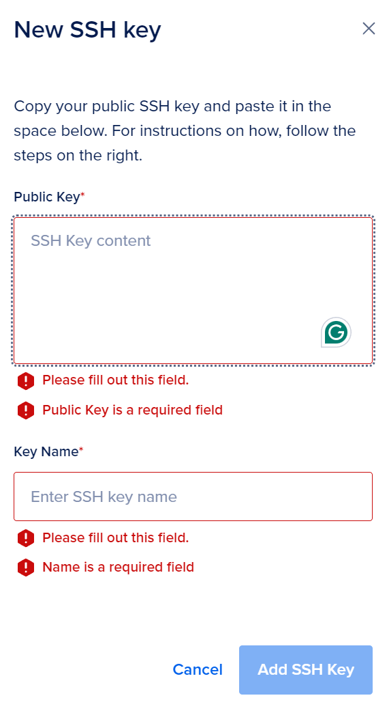
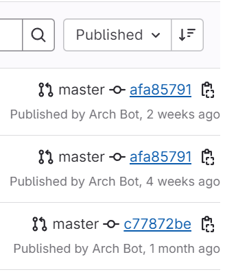
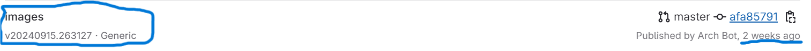
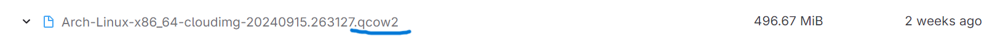
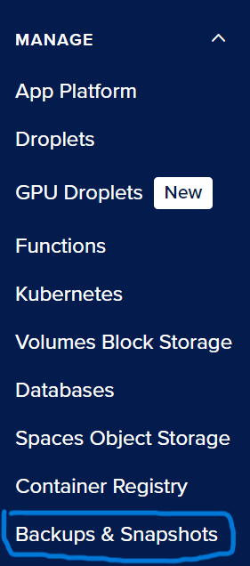
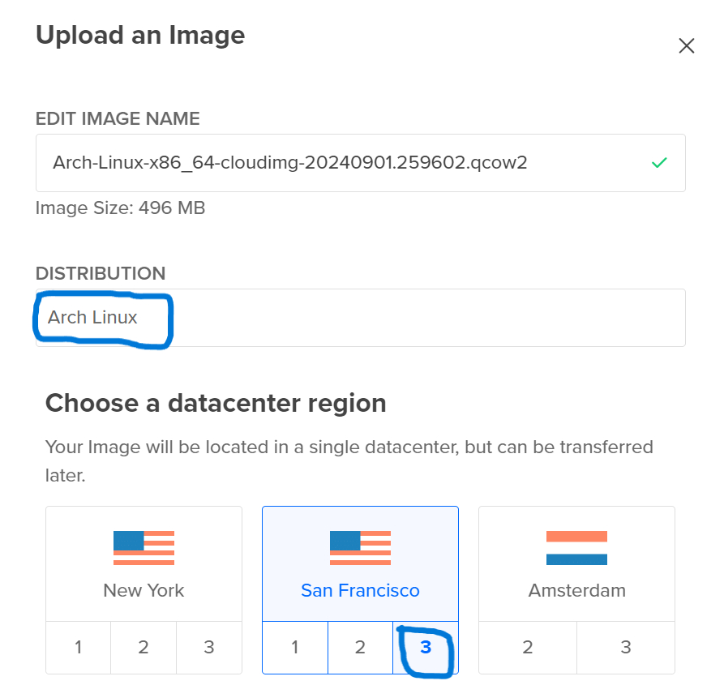
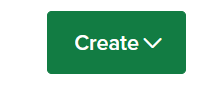

# Remote Server Creation Tutorial 
This tutorial will explain how you can create a remote server through a Linux Virtual Machine (VM) using Digital Ocean, a cloud service provider. 

In this tutorial, you will learn how to: 
- **Create SSH keys on your local machine**
- **Use the web console to add a custom Arch Linux image**
- **Create a Droplet**
- **Use a cloud-init configuration file**
- **Use your SSH keys to connect to your server.**

# Requirements
- A computer with Windows OS 
- Access to Windows Powershell 
- Command-line input knowledge 
- A Digital Ocean Account 

# Create an SSH Key 
Before we get started, you may be wondering what SSH means and what an SSH key is. SSH stands for Secure Shell and it is a security protocol that manages communication between a device and a "unsecured network" (Cloudflare). In this case, the SSH protocol is managing the communication between a computer and a remote server. When data is sent between the computer and the remote server, SSH will use "encryption"(Cloudflare) to make the data unreadable to any outside party that's not involved between the connection. 

An SSH key involves a two-way process. It has a public key that is accessible to anyone and a private key that's only accessible by the key owner. This means you can access the server with or without a password as long as you have the key. Since the SSH will always have two keys, it is also called an SSH key pair.In this case, you are the private key owner and Digital Ocean is the server that will hold the public key. Now, let's get started!

Step 1: Open Windows Powershell 

Step 2: In the command-line, copy and paste this path.
``` 
ssh-keygen -t ed25519 -f C:\Users\your-user-name\.ssh\something-key -C "youremail@email.com"
```

Step 3: Customize the path you copy/pasted
- Replace "your-user-name" with your Windows username
- Name your key. Change "something-key" into your desired name. Ex: "ocean-key"
- Replace "youremail@email.com" with your desired email address

Step 4: Press the "Enter" key. You will be asked to enter a passphrase or to leave it empty for no passphrase. The passphrase is for your private key. 

You will then receive a confirmation message that your key has now been created. You have now successfully created your SSH key pair. 

Step 5: Now that you have configured your private key, you need to add your public key to Digital Ocean. In the PowerShell command-line, copy and paste this command. 
```
Get-Content C:\Users\your-user-name\.ssh\something-key.pub | Set-Clipboard
```

Step 6: Customize the path with your username and key name. 

Step 7: In your web browser, go to the [Digital Ocean website] (https://cloud.digitalocean.com/) and log in. 

Step 8: Once you have logged in, on the left hand side, under 'By DigitalOcean', click 'Settings'. 

Step 9: Click the 'Security' tab. 

Step 10: On the right hand side, click 'Add SSH Key'. 


Step 11: Paste the public key contents that you copied earlier and type a name for your key. After, click 'Add SSH Key'. 

You have now successfully connected your public key to your DigitalOcean account. 


# Add Custom Arch Linux Image 
Next, you will need to download and add a custom Arch Linux image to Digital Ocean. You may be wondering what a custom image is. According to the Digital Ocean Official Documentation page, "Custom images are Linux distributions that have been modified to fit the specific needs of the developer"(Gonzales, 2018). These images are not "pictures" in this context. A custom Arch Linux image is an Arch Linux distribution (distro). It is a downloadable installation package that contains the necessary software to emulate a version (Arch) of a Linux environment (Rudareanu & Baturin, 2023). We need this image to create a Droplet in Digital Ocean, but we will explain more about that later. Now, let's get started! 

Step 1: Open your Web Browser and navigate to this website link. 
```
https://gitlab.archlinux.org/archlinux/arch-boxes/-/packages/
```

Step 2: On the right hand side of the page, under Published, you will see the publisher name and the date the image was published. 


Locate the most current date and click 'images' on the left hand side. 


Step 3: Under 'Assets', locate the cloud image file that has '.qcow2' at the end of the file name.
assets/qcow2.png

Click on the file name to download it automatically. 

Step 4: Log into your Digital Ocean account. 

Step 5: On the left hand side, under 'Manage', click 'Backups & Snapshots'. 



Step 6: Click 'Custom Images'. 

Step 7: On the right hand side, click 'Upload image'. Select the cloud image file that you just downloaded. You will be redirected to this window. 

As highlighted in the image above, under 'Choose a Distribution', select 'Arch Linux'. Under 'Choose a datacenter region', select 'San Francisco' and '3'. These settings will determine which cloud server your image will be hosted on. 

Step 8: Click 'Upload Image'. You have now successfully added your Arch Linux image to Digital Ocean. 

# Create a Droplet
Next, you will need a create a Droplet. A Droplet is 

Once you have logged in, on the top right hand side, click 'Create'. 



